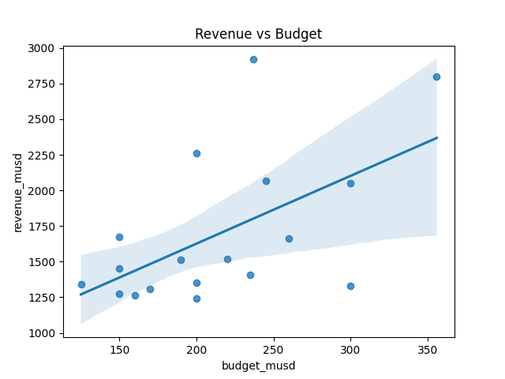
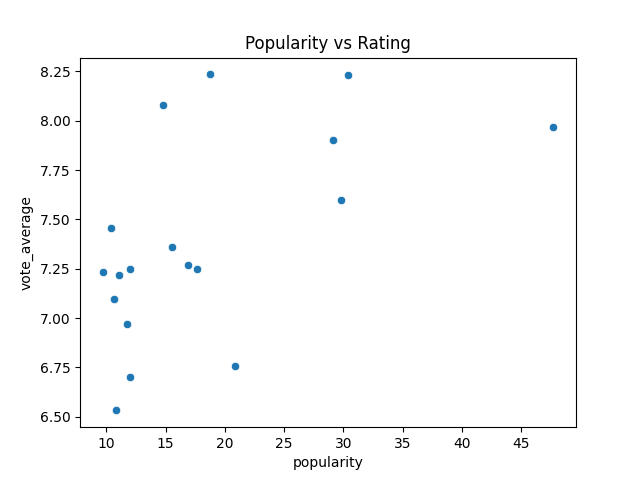
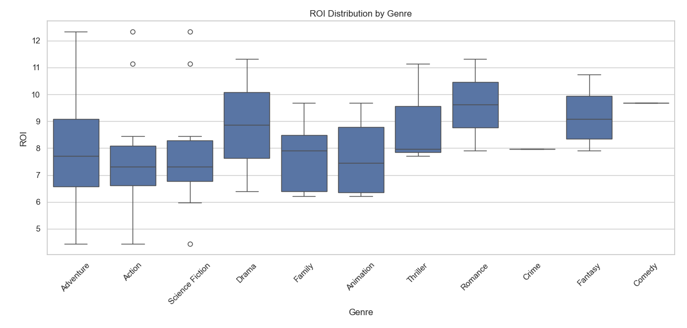
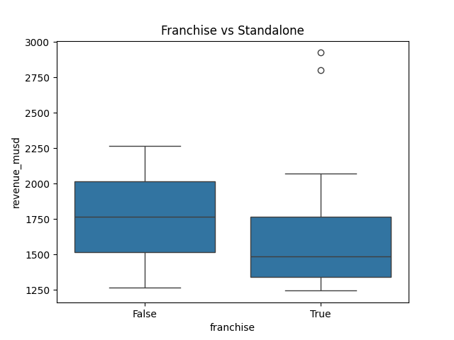
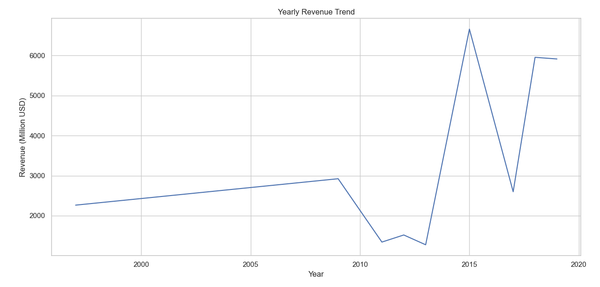

# TMDB Movie Data Analysis

##  Introduction

In this project, I analyzed movie data collected from the TMDB API.  The goal was to understand how movies perform financially, how efficient they are relative to their budgets, and how audiences respond to them.

##  Data Source

The dataset was obtained from the TMDB API and includes:

- Financial data (budget and revenue)  
- Audience metrics (ratings, vote counts, popularity)  
- Movie information (genres, collections, cast, and directors)
This analysis is based on a selected set of popular movies.

##  Methodology

I built a pipeline to process the data step by step:

- Fetch data from the API  
- Clean and organize the dataset  
- Create new features such as profit and ROI. These features were then used to compare and rank movies.

##  Results and Interpretation

### Top Revenue and Profit

From the results, *Avatar* is the highest earning movie, with more than **2900 million USD** in revenue. and it is followed by *Avengers: Endgame* and *Titanic*.

I noticed that the movies with the highest revenue also appear at the top in terms of profit. This means they were able to recover their production costs very well. However, some movies like *Star Wars: The Last Jedi* still made a profit but ranked lower, showing that they are less efficient compared to others.

### Return on Investment (ROI)

ROI gives a clearer view of efficiency. Even though *Avatar* is still the top movie, others like *Jurassic World* and *Harry Potter and the Deathly Hallows: Part 2* also perform very well.

This shows that:
- High revenue does not always mean high efficiency  
- Budget plays a big role in performance  
Thus, Movies with lower ROI tend to have very high budgets, which reduces their efficiency.

### Budget vs Revenue

There is a clear positive relationship between budget and revenue.
Movies with larger budgets generally generate higher revenue. However, some movies with similar budgets have very different results, which means budget alone does not guarantee success.

### Audience Engagement

*The Avengers* has the highest number of votes, showing strong audience engagement.

Movies like *Avengers: Endgame* and *Avengers: Infinity War* also have high ratings, meaning they are both popular and well-received. At the same time, some movies earn a lot but have lower ratings. This shows that popularity and quality are not always the same.

### ROI by Genre

ROI varies across genres. Some genres perform more consistently, while others show more variation. This suggests that genre can influence how efficiently a movie performs.

### Franchise vs Standalone Movies

Key findings:

- Franchise movies typically have higher budgets
- They deliver more consistent performance
- Standalone movies show greater variation in results

  Franchises offer stability, while standalone movies can either exceed expectations or underperform.

### Most Successful Franchises

The **Avengers Collection** is the most successful franchise in terms of total revenue.

Other franchises, such as *Star Wars*, also perform well, but not at the same level. This shows that consistent performance across multiple movies is important.

### Most Successful Directors

**James Cameron** stands out as the most successful director, mainly because of *Avatar* and *Titanic*. Other directors also perform well, particularly those involved in large-franchise films.

### Revenue Trends Over Time

Revenue changes across years, with peaks during major movie releases. This suggests that performance depends more on specific blockbuster movies rather than steady growth.

##  Key Observations

- High revenue often leads to high profit  
- ROI helps identify efficient movies  
- Budget increases potential but does not guarantee success  
- Popularity and ratings measure different things  
- Franchise movies are more stable  
- Standalone movies are more unpredictable  

##  Limitations

- The dataset is small and includes only selected movies  
- Results may not represent the entire movie industry  
- Some filters returned empty results  
- Inflation and other external factors were not considered  

##  Challenges

- Handling nested JSON data from the API  
- Dealing with missing or inconsistent values  
- Ensuring consistency across pipeline steps  
- Debugging unexpected results  

##  Conclusion

This project shows how raw data from an API can be cleaned and turned into useful insights using a simple pipeline. The results show that both budget and efficiency matter when looking at movie performance, since movies with big budgets usually earn more, but ROI helps show how well that money is actually used. Overall, the pipeline works well and can be improved later for deeper analysis.
